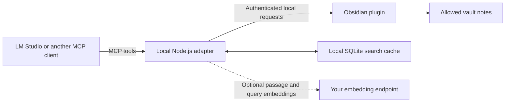

# MCP Vault Bridge

[](https://github.com/allexcd/obsidian-mcp/actions/workflows/ci.yml)
[](https://github.com/allexcd/obsidian-mcp/releases)
[](LICENSE)

Connect LM Studio or another MCP client to the Obsidian notes you choose to expose. Ask questions with sources, find related notes, inspect links and Properties, and optionally create or edit notes and Bases.

**Read-only by default. Embeddings are optional. Your notes remain the source of truth.**

> This README describes the development version. See the [changelog](CHANGELOG.md) and your installed release before relying on newer settings or synchronization features.

## How it works



The client runs your **chat model**, which chooses tools and writes answers. The adapter retrieves evidence from your vault. An optional **embedding model** helps find passages with similar meaning; it does not write the answer.

MCP provides access to Obsidian. Skills describe workflows, such as a weekly review, using those tools. Skills require support in your client and are not required by this plugin or installed into a model's weights.

## What you need

- Desktop Obsidian, open with MCP Vault Bridge enabled.
- Node.js 20 or newer. Setup checks the executable and SQLite compatibility.
- An MCP client with a chat model that can use tools. A local model's tool reliability affects the experience.
- **No embedding model is needed** for standard search, reading, links, Properties, or editing.

LM Studio supports MCP servers; see its [connection instructions](https://lmstudio.ai/docs/app/mcp). Cloud-model clients can send retrieved passages to their provider even though this bridge runs locally.

## Quick start

1. Install **MCP Vault Bridge** through Obsidian Community Plugins, or install the plugin files from [Releases](https://github.com/allexcd/obsidian-mcp/releases).
2. Enable the plugin and open its settings.
3. Review **Vault access**. Regular Markdown notes are included by default; exclude private folders, files, or tags. Leave editing disabled unless you need it.
4. In **Setup**, wait for the runtime check. If needed, select **Install required components**. This installs the SQLite runtime, not an AI model.
5. Select **Copy LM Studio** or **Copy Claude**. The copied configuration includes the existing token and resolved Node path; the on-screen preview masks the token.
6. Merge the copied server entry into your client's `mcpServers` configuration. Preserve other servers. Reload the client's MCP servers or restart the client.
7. Ask: **“Find notes about project planning and cite the notes you used.”**

The adapter reconciles the index when it connects, then follows vault changes automatically. Standard search becomes available before semantic indexing finishes. **Setup → Refresh status** shows recent adapter activity and synchronization state. “Bridge running” alone does not mean a client is connected.

Use **Refresh index** for recovery. Requests wait for the next adapter connection if none is active. Keep Obsidian open while using the bridge.

## Things to try

| Ask your assistant | Requires editing? |
|---|---|
| “Find notes titled or aliased Launch plan.” | No |
| “What risks do my project notes mention? Cite the relevant passages.” | No |
| “Read the Risks section of Projects/Roadmap.md.” | No |
| “Which notes link to Projects/Roadmap.md?” | No |
| “Give me an overview across my folders and explain how much of the vault you sampled.” | No |
| “Set the status property of Projects/Roadmap.md to draft.” | Yes |
| “Append these meeting decisions to Projects/Roadmap.md.” | Yes |
| “Create a Base for the Articles/Science folder, showing title, author, and date.” | Yes |

Enable **Vault access → Allow creating and editing notes** for authoring. Edits can use the note revision returned by a read to reject conflicting changes. No file deletion or shell execution tool is exposed.

For Bases, the assistant must resolve the actual folder or file paths and choose an explicit scope. Whole-vault scope is used only when requested. Generated Bases exclude `.base` files by default.

## Search: standard or by meaning?

| State | What to expect |
|---|---|
| **Standard search** | Matches words, titles, aliases, phrases, and indexed text. Works without another model. |
| **Building semantic index** | Standard search works; semantic coverage is still incomplete. |
| **Semantic search ready** | Hybrid search combines keyword ranking and similarity in meaning. |
| **Semantic search unavailable—using standard search** | The endpoint or configuration failed. Keyword search, reading, and editing remain available. |

For example, searching for “burnout” may miss “exhaustion from work” using keywords alone. Search by meaning can help find that passage.

To enable it, open **MCP clients → Search → Set up search by meaning…**, enter your endpoint and exact embedding model identifier, test the request, enable the option, and reload your client. No model is downloaded automatically. See the [local embedding setup guide](docs/lm-studio-embeddings.md).

Search results are evidence, not generated answers. No-match results say so. `analyze_vault` returns a bounded sample distributed across folders and dates, with represented/total counts; it does not read every note or guarantee exhaustive conclusions.

## Access and privacy

- The bridge listens on `127.0.0.1` and requires a bearer token.
- Hidden/configuration folders, trash, Git internals, and traversal paths are blocked.
- Cached results are checked against current access before they are returned. Newly excluded cached notes are removed during synchronization; enforcement does not wait for a full rebuild.
- If current access cannot be verified, cached vault results are not returned.
- SQLite stores a rebuildable local copy of exposed note content and optional vectors. Exclusions cannot retract information already returned to a client, and cache deletion is not a secure disk-erasure guarantee.
- A cloud chat model may receive tool results. An external embedding endpoint may receive note passages and queries. Local chat and embedding models can keep both on your machine.
- No telemetry is added by this plugin.

Keep copied configurations private because they contain the token. Token regeneration is under **Advanced** and requires updating every client configuration. See [security details](docs/security.md).

## Troubleshooting

| Symptom | Check | Action |
|---|---|---|
| Client cannot start the adapter | Setup runtime status | Install/repair required components; copy the newly resolved configuration. |
| Node or SQLite compatibility error | Advanced runtime diagnostics | Use the detected compatible Node executable or set an override, then reload the client. |
| Bridge stopped | Setup bridge status | Start the bridge; resolve a port conflict if shown. |
| Unauthorized | Whether the token was regenerated | Copy a fresh complete configuration. |
| Configuration ready but no client activity | Client MCP configuration | Check the entry, reload the client, and keep this vault open. |
| Missing or stale note | Vault access and synchronization status | Check exclusions; use Refresh index if reconciliation needs recovery. |
| Search by meaning unavailable | MCP clients embedding test and `index_status` | Check the endpoint and exact model identifier. Standard search still works. |
| Editing rejected | Vault access / returned conflict | Enable editing if intended; on a revision conflict, read the note again before editing. |
| Setting seems ignored | `index_status.embeddingOverrides` | Remove or update explicit environment overrides, then reload the client. |

## Reference and development

- [Tools, configuration, and protocol reference](docs/reference.md)
- [LM Studio with optional local embeddings](docs/lm-studio-embeddings.md)
- [Security model](docs/security.md)
- [Validation record](docs/validation.md)
- [Contributing](CONTRIBUTING.md) and [changelog](CHANGELOG.md)

```bash
npm install
npm run build
npm test
npm run typecheck
npm run lint
npm run lint:obsidian
```

To install a development build into a disposable vault:

```bash
npm run plugin:install -- --vault "/absolute/path/to/Test Vault"
```

The community registry lists this plugin under `mcp-vault-bridge`; a listing is not a security certification. License: [MIT](LICENSE).
